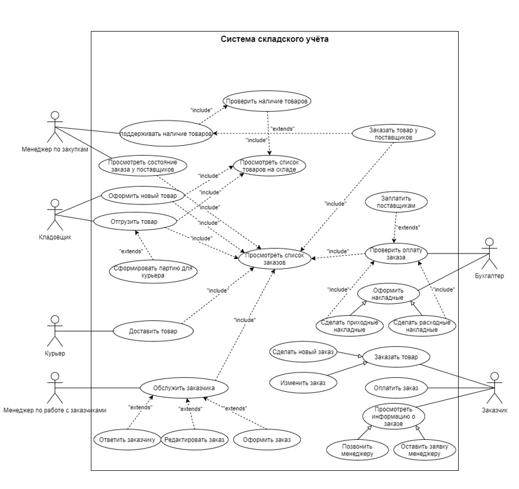

# Система складского учета

## Основные требования к приложению

Некая компания, под названием ПЯТАЯ СИЛА, имеющая большой товарный оборот на собственных складские площадях и ведущая вручную весь учет, озабочена автоматизацией процесса движения товара на складах. Для решения данной проблемы было разработано данное приложение. С данным приложением могут работать: бухгалтер, кладовщик, курьер, менеджер по закупкам, менеджер по работе с заказчиками. Также через это приложение заказчики могут просматривать каталог, делать заказы и делать заявки к менеджеру. 

Необходимая функциональность:
- Авторизация для нескольких ролей персонала и роли для заказчика
- Добавление,просмотр и обработка заказов
- Расчёт стоимости заказов
- Возможность взаимодействия заказчика и менеджера
- Ведение счётов
- Каталог товаров

Анализ требований
-----------------

Проектирование
--------------

### Команде разработчиков был выделен один месяц на написание проекта, из которого 3 недели ушло на распитие спиртных напитков. Проект был сделан, чтобы залутать бабло, но бюджет проекта составлял 0 рублей. Разработчики были сильно огорчены, поэтому решили сделать менюшку доната. Вообще мы очень любим ставить на *скачки пони.*
Проект ориентировался на систему складского учета Электросилы и 5 элемента. Но если они купят данный проект за 2 пони, боюсь что через месяц они обанкротятся.

