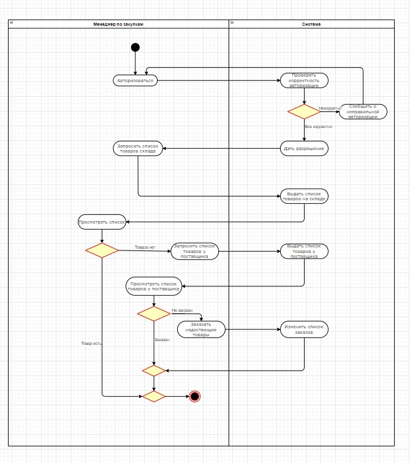

# Система складского учета

## Основные требования к приложению

Некая компания, имеющая большой товарный оборот на собственных складские площадях и ведущая вручную весь учет, озабочена автоматизацией процесса движения товара на складах. Для решения данной проблемы было разработано данное приложение.

Необходимая функциональность:
- Несколько ролей для персонала и роль посетитель
- Добавление,просмотр и обработка заказов
- Расчёт стоимости заказов
- Возможность взаимодействия заказчика и менеджера
- Ведение счётов

Анализ требований
-----------------

Проектирование
--------------

